# System Diagrams — Mô hình hóa toàn bộ hệ thống

> Tất cả diagram dùng Mermaid syntax. Render trực tiếp trên GitHub hoặc qua [mermaid.live](https://mermaid.live).

---

## 1. Kiến trúc tổng quan (Context Diagram)

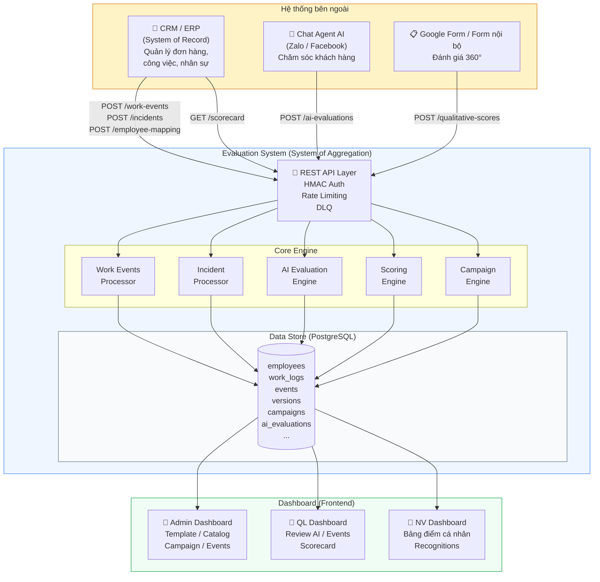

---

## 2. Entity Relationship Diagram (ERD)

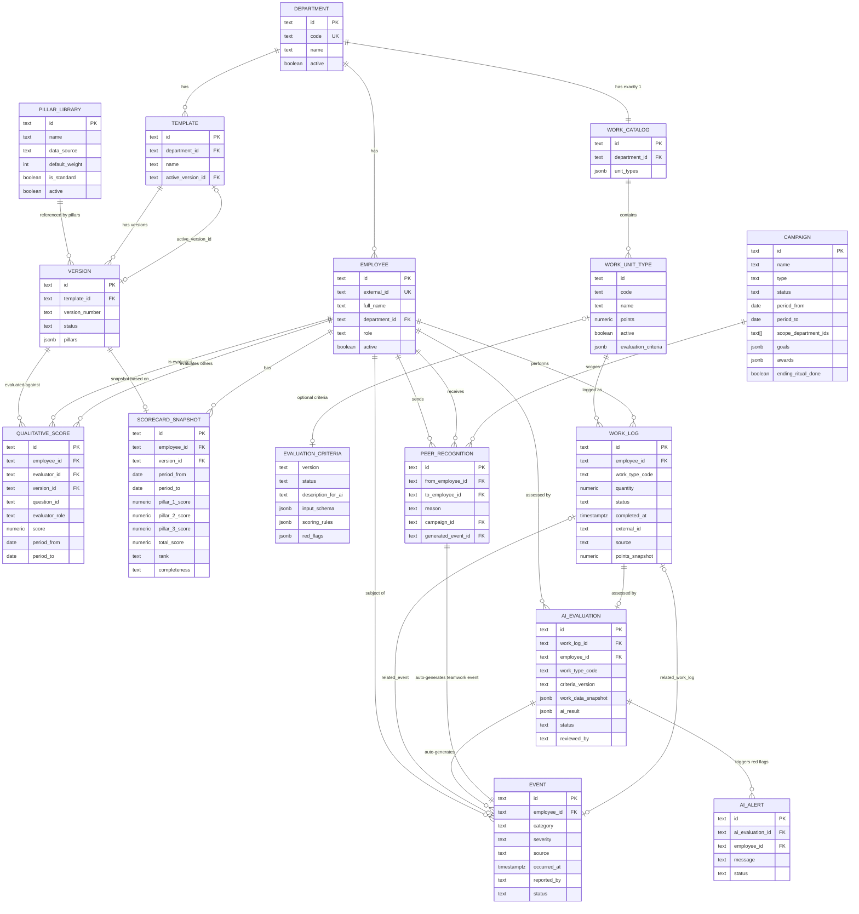

---

## 3. Scoring Pipeline (Luồng tính điểm cuối kỳ)

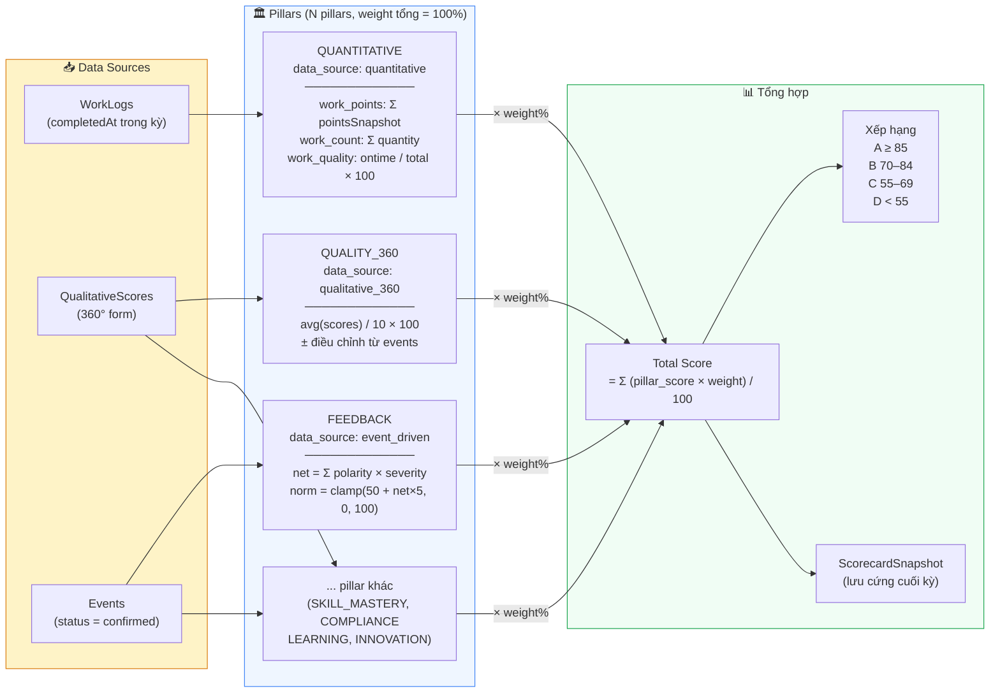

---

## 4. AI Evaluation — Sequence Diagram

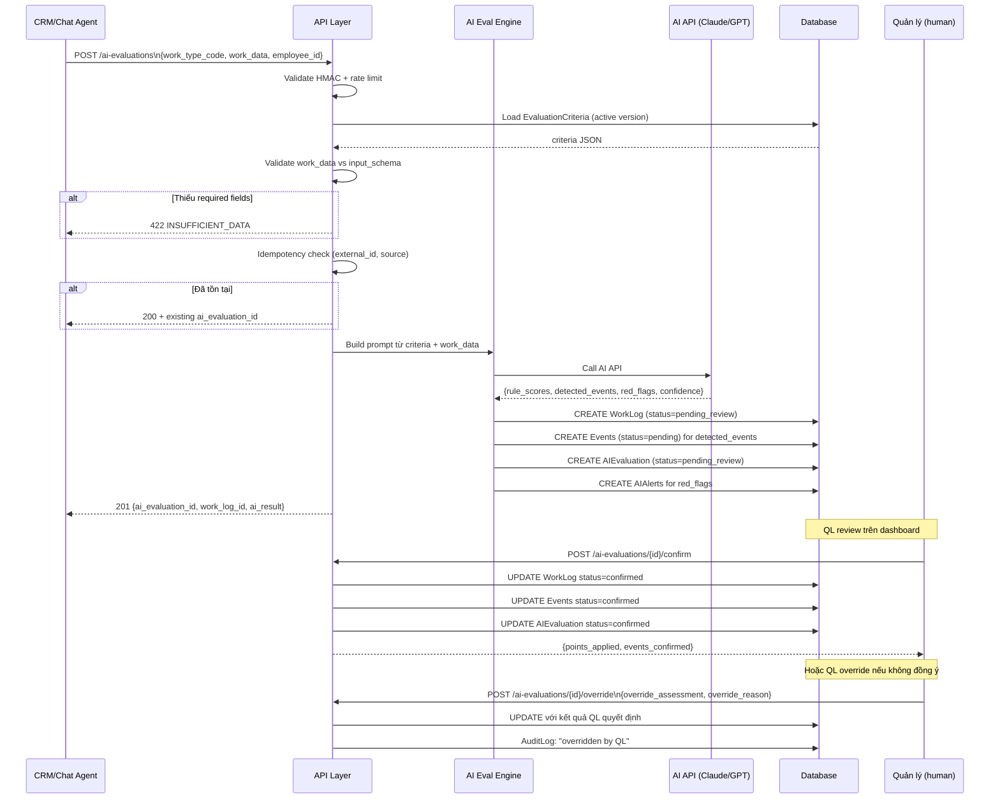

---

## 5. State Machines

### 5a. Event (Sự vụ) — Vòng đời

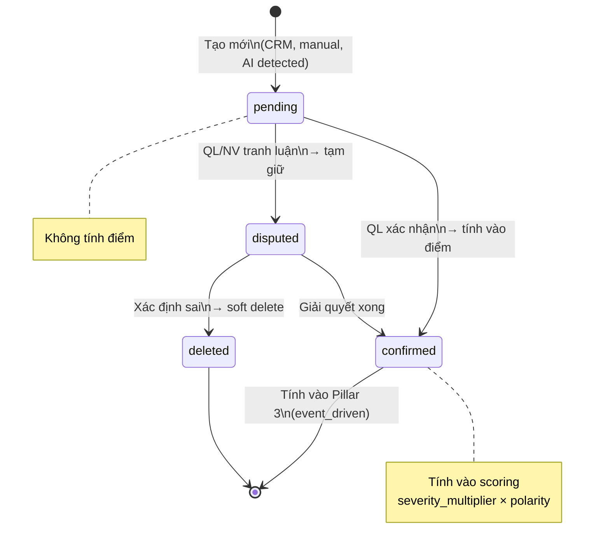

### 5b. Version — Vòng đời

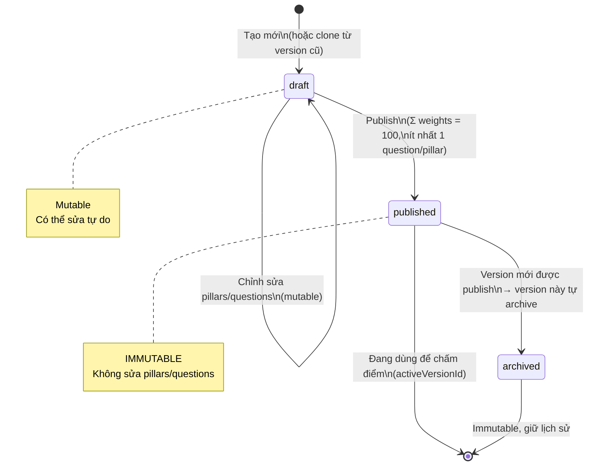

### 5c. Campaign — Vòng đời

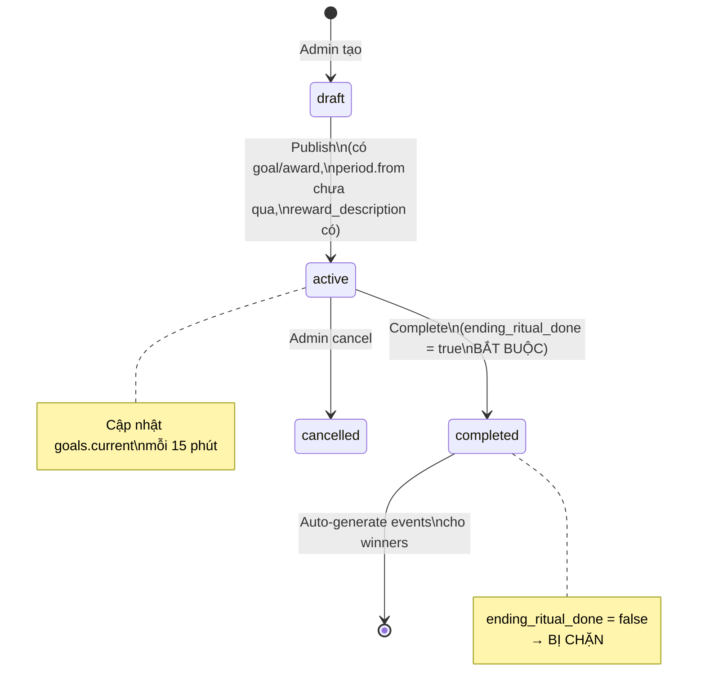

### 5d. AIEvaluation — Vòng đời

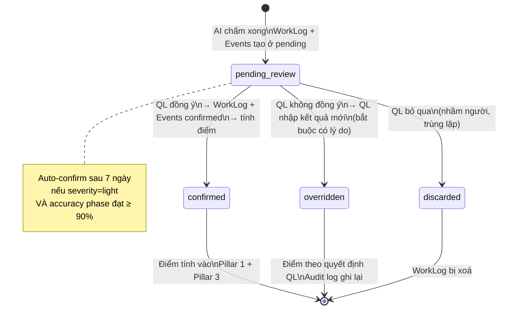

---

## 6. API Integration Flow (CRM → Eval System)

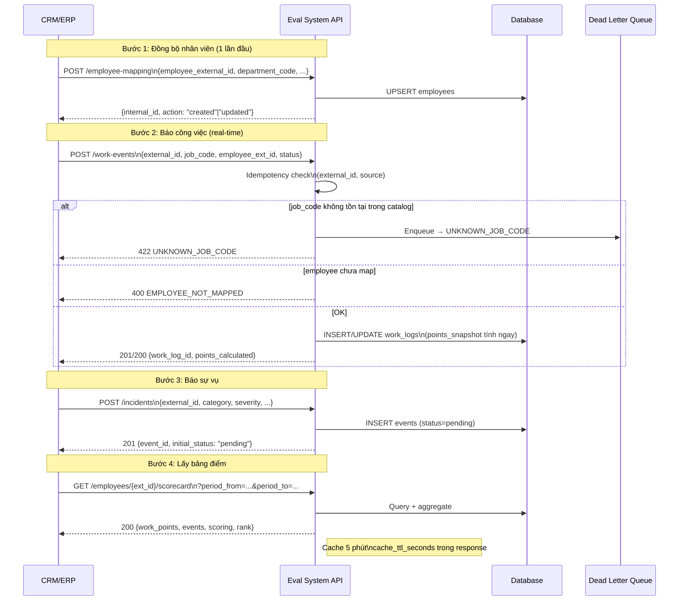

---

## 7. Data Flow — Từ nguồn đến Scorecard

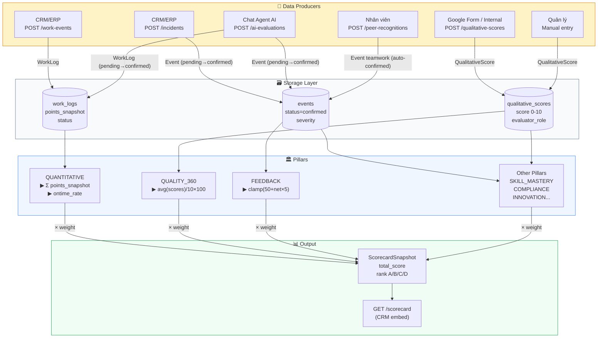

---

## 8. Campaign Flow

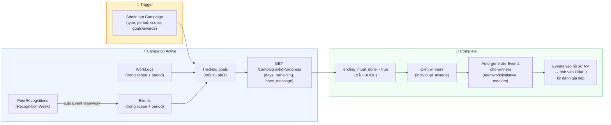

---

## 9. Template & Pillar Library — Quan hệ chọn pillar

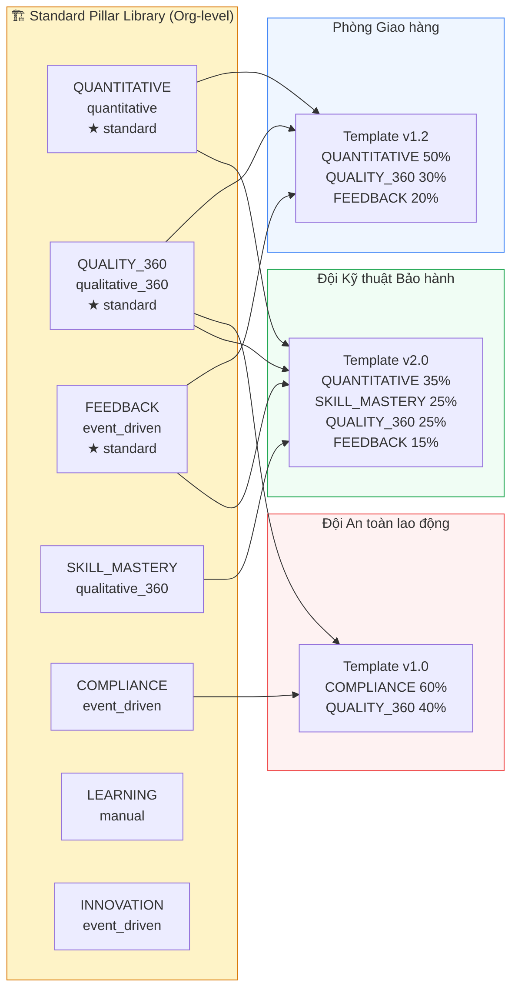

---

## Ghi chú đọc diagram

| Ký hiệu ERD | Nghĩa |
|-------------|-------|
| `\|\|--o{` | 1 bắt buộc — N tùy chọn |
| `\|o--o\|` | 0..1 — 0..1 |
| `\|\|--\|\|` | 1 — 1 bắt buộc |

| Màu sắc | Tầng |
|---------|------|
| 🟡 Vàng | External systems / Data producers |
| 🔵 Xanh dương | Core engine / Pillars |
| 🟢 Xanh lá | Output / Result |
| ⚪ Xám | Storage / Database |
