# System Diagrams — Mô hình hóa toàn bộ hệ thống

> Tất cả diagram dùng Mermaid syntax. Render trực tiếp trên GitHub hoặc qua [mermaid.live](https://mermaid.live).

---

## 1. Kiến trúc tổng quan (Context Diagram)

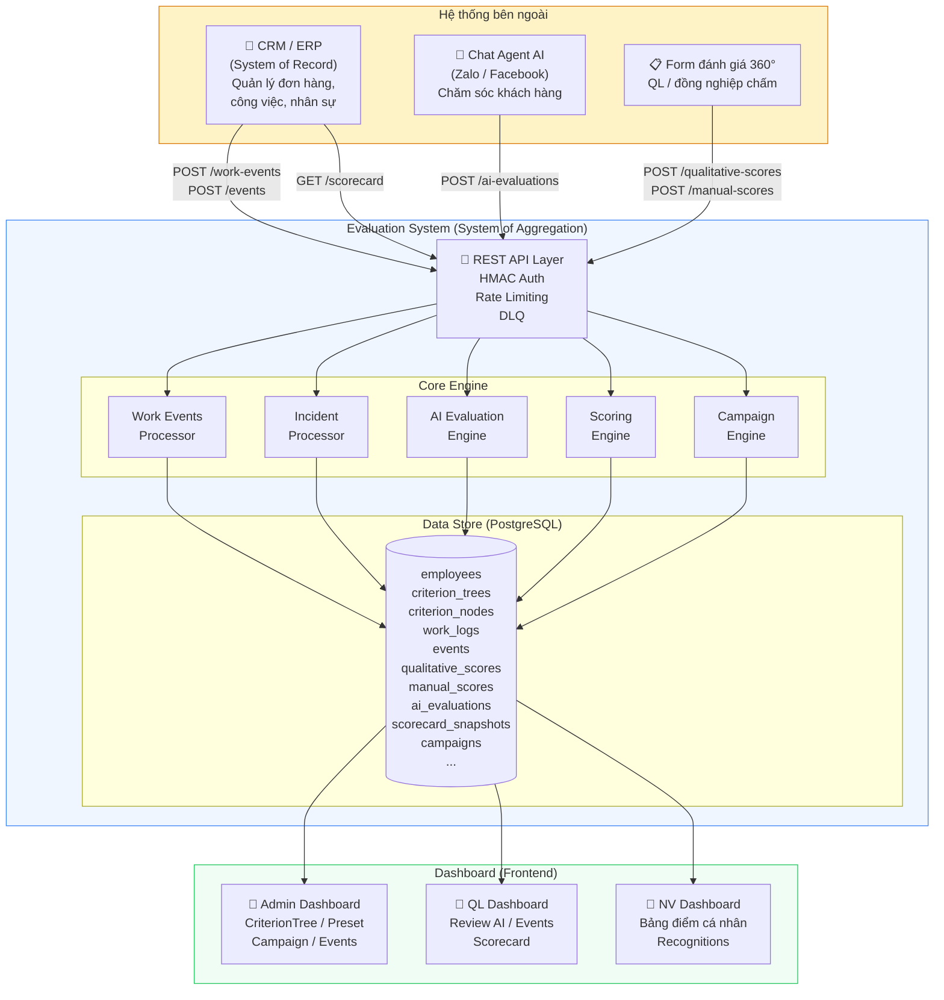

---

## 2. Entity Relationship Diagram (ERD)

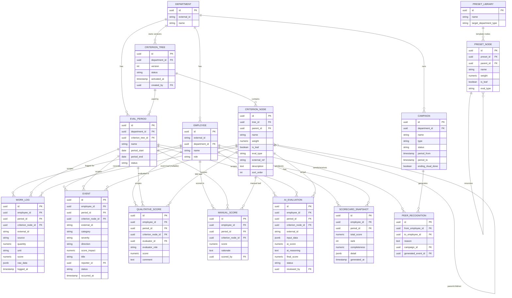

---

## 3. Scoring Pipeline — Tree Traversal

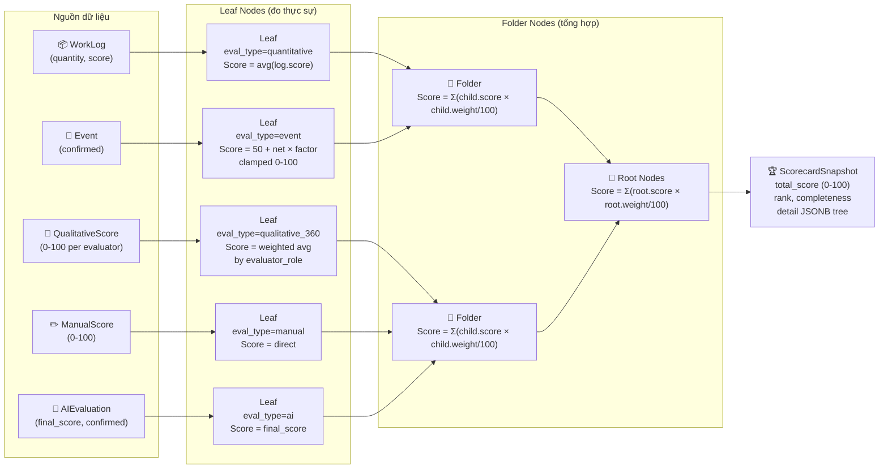

---

## 4. AI Evaluation — Sequence Diagram

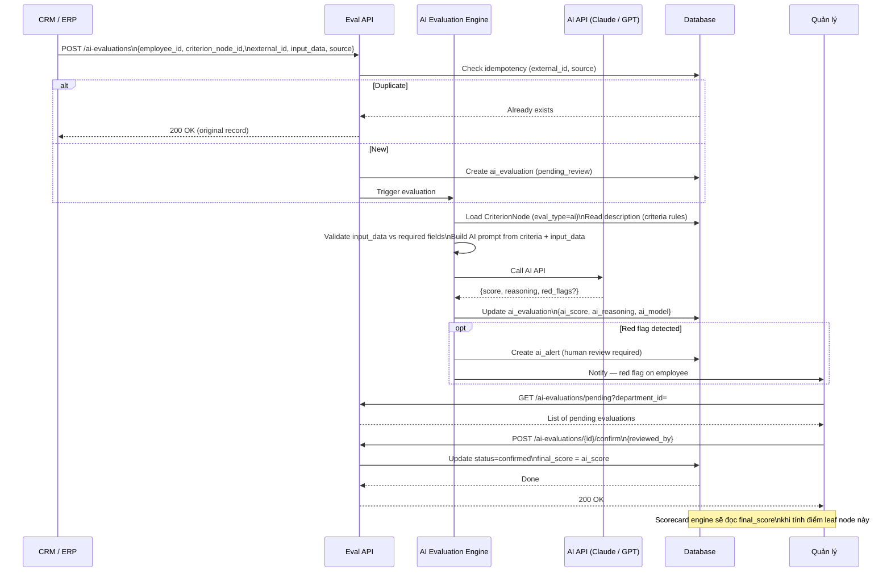

---

## 5. State Machine — Event / Sự vụ

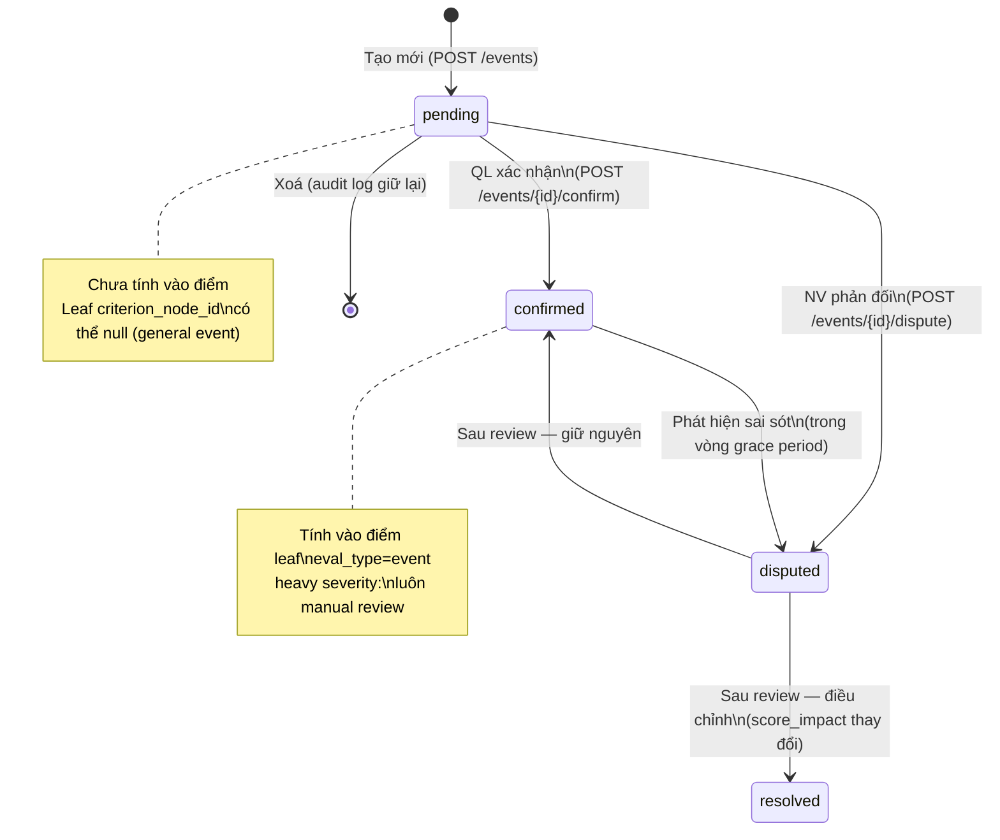

---

## 6. State Machine — CriterionTree Version

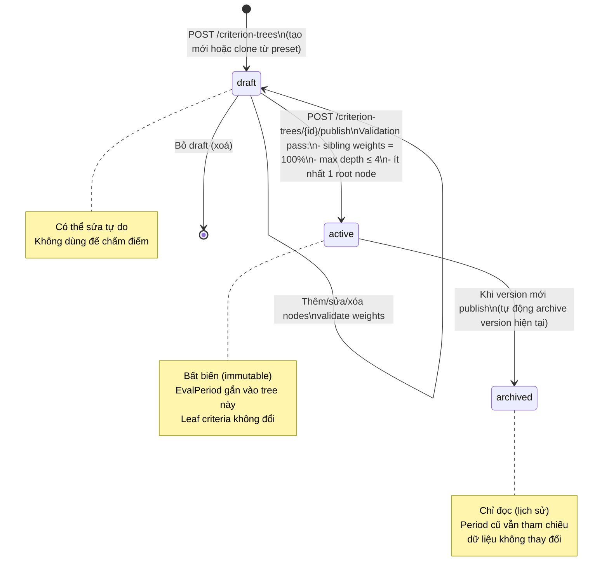

---

## 7. State Machine — Campaign

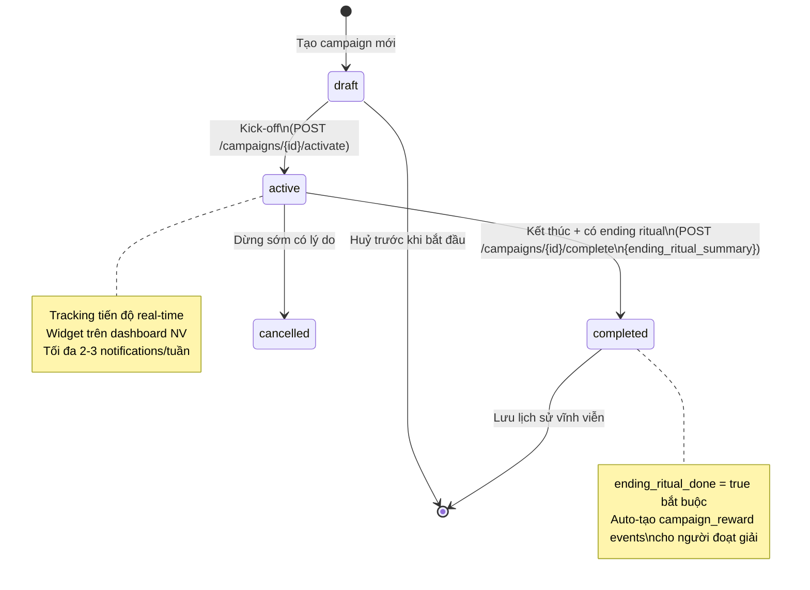

---

## 8. State Machine — AI Evaluation

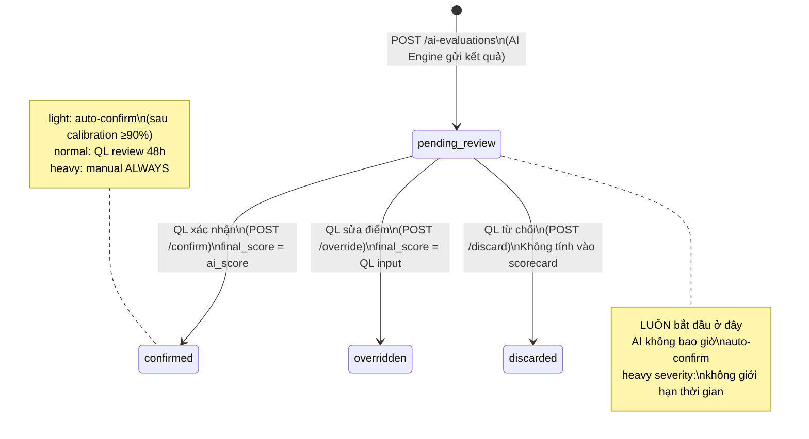

---

## 9. API Integration Flow — CRM → Eval System

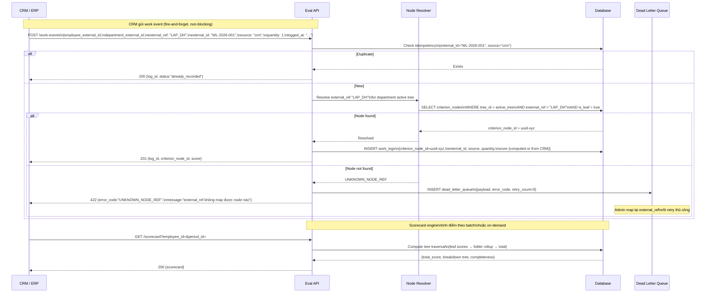

---

## 10. Data Flow — Từ nguồn đến Scorecard

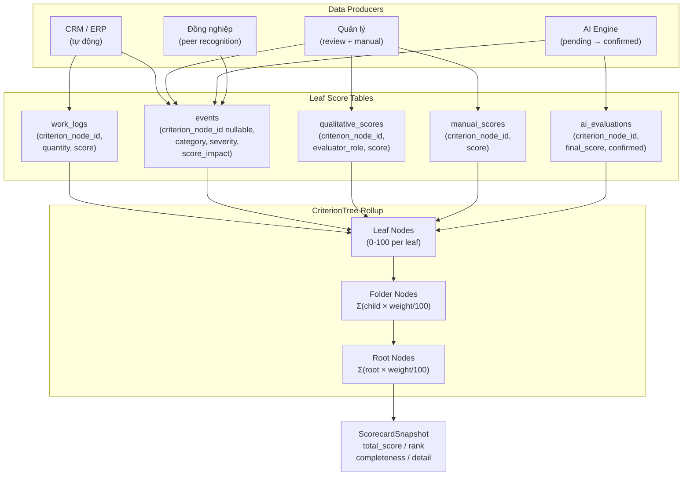

---

## 11. Campaign Flow

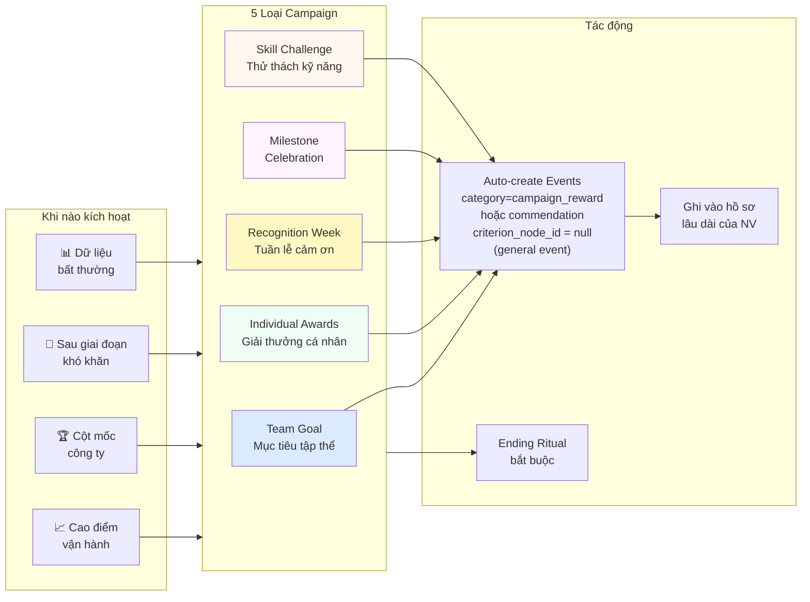

---

## 12. CriterionTree & Preset Library

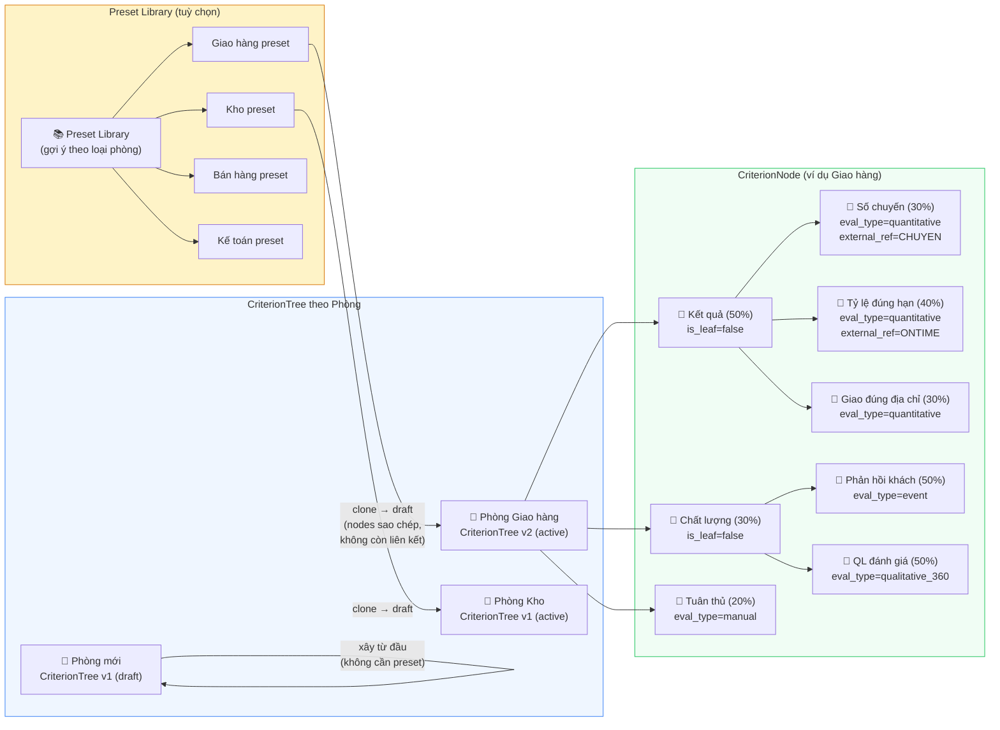
